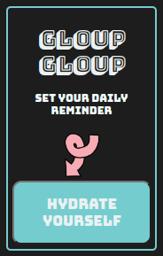

# Gloup Gloup Chrome Extension

It's a simple Chrome extension that puts a reminder at the start of our day with our PC, reminding us every hour to drink water, because " Moi j'adore l'eau, dans 20 ou 30 ans y en aura plus. J'espère que non " to quote JCVD.

## Tech & Misc

-JavaScript
-Html&CSS

-Chrome Extension Developer Mode
-Icones8

## ScreenShot

## Installation

Navigate to [chrome://extensions/](chrome://extensions/) and click the "Load
unpacked extension..." button. Navigate to and select this directory.
You should then see an "Gloup Gloup" extension and see the app when
you click on it.

### FYI

This is my previous repo here : https://github.com/miazarre/gloup-gloup-chrome-ext
Nothing works, but it's in the mistakes that you learn, I suppose.
